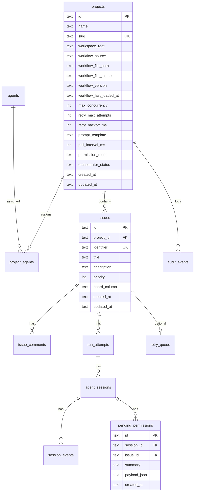
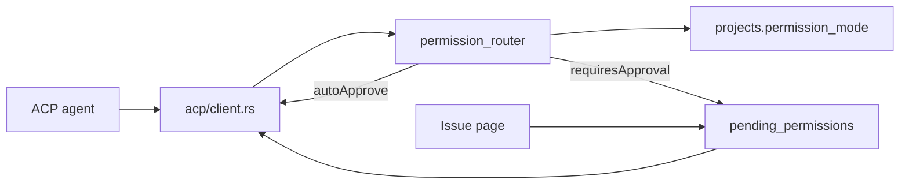
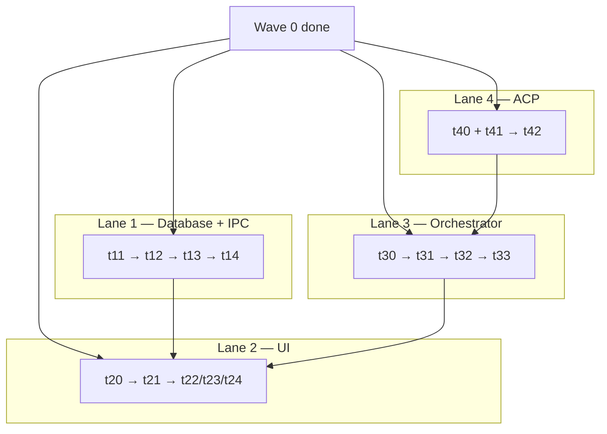

# Symphony: Electron → Tauri migration (execution plan)

Wave 0 complete. Four parallel lanes (Database+IPC, UI, Orchestrator, ACP). Reference deletion, docs, and tests happen in-lane on exit — no separate cleanup track.

## Locked decisions

| Area | Choice |
| ---- | ------ |
| Backend | Full Rust in `src-tauri/` — no Node sidecar |
| SQLite | **`rusqlite`** (bundled SQLite) |
| Migrations | **Single `001_init.sql`** at `{app_data_dir}/symphony.sqlite` |
| DB models | **Minimize tables** — workflow fields as **columns on `projects`**, not a separate config model or JSON blob |
| Issue column | **`BoardColumnId` enum** on every issue — `backlog` \| `inProgress` \| `review` \| `done` (camelCase JSON) |
| Issue mutations | **One IPC command per action** — no broad `mutate_issue` enum |
| Permissions | **Scoped to session + issue** — `pending_permissions.session_id` + `issue_id`; **resolved on issue page** |
| Permission mode | **Project column** `permission_mode` — `autoApprove` \| `requiresApproval`; policy default only |
| Session events | **Typed `SessionEventPayload`** per `SessionEventKind` — no opaque JSON in IPC |
| IPC payloads | **Narrow commands** — one read slice or one write action per invoke |
| Runtime IPC | `commands/runtime.rs` — slice reads + **one command per control action** (no `ControlRuntimeRequest` enum) |
| `generatedAt` | **Dropped** — hooks track fetch time locally if needed |
| Home page (`/`) | Dashboard — **stats only** |
| Board (`/board`) | **Task allocation** — fixed 4-column kanban; 4 parallel `get_board_column` on mount |
| Issue page | Comments, run history, session timeline, **permission approve/deny** |
| Agents page | **Agent config only** — no permission queue |
| Project isolation | Independent poll loop, workspace tree, flat workflow columns per project |
| Pause | **In-process gate only** — no SIGSTOP |
| ACP | **`agent-client-protocol`** + **`agent-client-protocol-tokio`** + **`agent-client-protocol-test`** |
| Mock location | **`src-tauri/mock-acp-agent/`** — standalone workspace crate (no Tauri dep); **not** inside `acp/` |
| Pause gate | **`PauseGate` trait** in `runtime/`; **impl** in orchestrator (Lane 3); adapter consumes injected gate |
| IPC hooks | Private `useIpcQuery` / `useIpcMutation` in `src/lib/ipc/hooks.ts` — domain hooks only |
| UI library | shadcn/ui + blocks.so (or equivalent) — port concepts, not pixel-perfect reference |
| Reference stack | `reference/electron-stack/` temporary — **each lane deletes its ported subtree on exit** (no separate cleanup track) |

### Command module layout (locked)

```
src-tauri/src/commands/
  runtime.rs          # runtime slice reads + per-action controls
  board.rs            # get_board_column, get_board_issue_card
  issue.rs            # issue reads
  issue_write.rs      # per-action issue writes
  project.rs          # narrow project field reads
  project_write.rs    # narrow project field writes
  agent.rs            # agent reads
  agent_write.rs      # agent writes + assignment
  app_state.rs        # active project id
  permissions.rs      # list_issue_pending_permissions, resolve_session_permission
```

Wave 0 monolithic stubs (`state.rs`, `control.rs`, `stubs/`) removed when **Lane 1 t14h** completes.

---

## Wave 0 — complete

| ID | Deliverable | Status |
| -- | ----------- | ------ |
| t01 | Rust toolchain + `@tauri-apps/cli` | ✓ |
| t02 | Restructure → `reference/electron-stack/` | ✓ |
| t03 | Next.js at repo root, shadcn in `src/` | ✓ |
| t04a–h | 8 monolithic stub IPC commands | ✓ |
| t05 | `src/lib/ipc/` + `useBoard` smoke test | ✓ |

Stubs replaced during **Lane 1 t13–t14**.

---

## Architecture contracts

### Database schema



**`issues.board_column` CHECK:** `backlog`, `inProgress`, `review`, `done`.

**`app_state`:** single row — `active_project_id`.

**No** `workflow_config_json`, **no** `WorkflowConfiguration` table, **no** `workflow_states`.

**Storage paths (outside repo):**

| Asset | Path |
| ----- | ---- |
| SQLite | `{app_data_dir}/symphony.sqlite` |
| Workspaces | `{app_data_dir}/workspaces/{project_id}/{issue_id}/` |
| Workflow file | `{app_data_dir}/projects/{project_id}/workflow.yaml` |
| Bundled seed | `src-tauri/resources/reference-workflow.yaml` → copied on `create_project` |

### `BoardColumnId` enum

```rust
pub enum BoardColumnId { Backlog, InProgress, Review, Done }
```

- **v1:** kanban placement + orchestrator candidate selection (backlog/inProgress dispatch-eligible)
- **future:** column-based behavior rules — enum stable now, rules layer on later

`transition_issue_column(issue_id, target_column, actor?)` replaces reference `target_state_id`.

### Typed session events

```rust
pub enum SessionEventKind {
    Prompt, StreamChunk, ToolCall,
    PermissionRequest, PermissionResolve,
    SessionUpdate, Error,
}

pub enum SessionEventPayload {
    Prompt(SessionEventPrompt),
    StreamChunk(SessionEventStreamChunk),
    ToolCall(SessionEventToolCall),
    PermissionRequest(SessionEventPermissionRequest),
    PermissionResolve(SessionEventPermissionResolve),
    SessionUpdate(SessionEventSessionUpdate),
    Error(SessionEventError),
}

pub struct SessionEvent {
    pub id: String,
    pub session_id: String,
    pub kind: SessionEventKind,
    pub payload: SessionEventPayload,
    pub created_at: String,
}
```

DB stores JSON in `session_events.payload_json`; repos deserialize to typed variants at the IPC boundary.

### Permissions

| Concern | Scope |
| ------- | ----- |
| Policy default | `projects.permission_mode` |
| Pending queue | `pending_permissions` — `session_id` + `issue_id` |
| Resolution UI | Issue page only |
| IPC read | `list_issue_pending_permissions(issue_id)` |
| IPC write | `resolve_session_permission(permission_id, decision)` |



### Narrow IPC catalog

**Board:** `get_board_column`, `get_board_issue_card`

**Issue reads:** `get_issue_header`, `list_issue_comments`, `list_issue_run_attempts`, `list_session_events`, `list_issue_pending_permissions`

**Issue writes:** `create_issue`, `update_issue_title`, `update_issue_description`, `update_issue_priority`, `transition_issue_column`, `add_issue_comment`

**Permissions:** `list_issue_pending_permissions`, `resolve_session_permission`

**Runtime reads:** `get_runtime_summary`, `get_runtime_running`, `get_runtime_retrying`, `get_runtime_candidates`, `get_runtime_recent_finished`, `get_runtime_recent_events`

**Runtime writes:** `start_runtime`, `stop_runtime`, `tick_runtime`, `set_runtime_poll_interval`, `clear_runtime_poll_interval_override`, `pause_run`, `resume_run`, `cancel_run`

**Project reads:** `list_project_summaries`, `get_project_name`, `get_project_workflow_source`, `get_project_workflow_file_path`, `get_project_workflow_version`, `get_project_prompt_template`, `get_project_poll_interval`, `get_project_max_concurrency`, `get_project_retry_policy`, `get_project_permission_mode`, `get_project_orchestrator_status`

**Project writes:** `create_project`, `delete_project`, `set_project_name`, `set_project_workflow_file`, `import_project_workflow_file`, `set_project_prompt_template`, `set_project_poll_interval`, `set_project_max_concurrency`, `set_project_retry_policy`, `set_project_permission_mode`

**App state:** `get_active_project_id`, `set_active_project_id`

**Agent:** `list_agent_summaries`, `get_agent`, `create_agent`, `delete_agent`, `set_agent_name`, `set_agent_acp_command`, `list_project_agent_ids`, `assign_agent_to_project`, `unassign_agent_from_project`

All commands: `opensymphony:*` naming; types in `src-tauri/src/types.rs` + `src/lib/ipc/types.ts`.

### Wave 0 stub → narrow IPC migration

| Wave 0 stub | Replacement |
| ----------- | ------------- |
| `get_project_board` | `get_board_column` |
| `get_issue` | issue read commands |
| `mutate_issue` | per-action issue writes |
| `get_runtime_state` | runtime slice reads |
| `control_runtime` | per-action runtime commands |
| `get_settings` | project + agent + app_state reads |
| `get_pending_permissions` | `list_issue_pending_permissions(issue_id)` |
| `resolve_permission` | `resolve_session_permission` |

Removed in **Lane 1 t14h**.

### App routes

| Route | Purpose |
| ----- | ------- |
| **`/`** | Dashboard — stats only |
| **`/board`** | Task allocation — kanban |
| **`/issue/[id]`** | Issue detail + permission resolution |
| **`/agents`** | Agent registry + assignment |
| **`/settings`** | Narrow project field reads/writes |

### Domain hooks

| Hook | IPC |
| ---- | --- |
| `useRuntime()` | runtime slices + per-action controls |
| `useBoardColumn(column)` | `get_board_column`, `transition_issue_column`, `create_issue` |
| `useIssue(id)` | issue reads/writes + permission resolve |
| `useProjectSettings(projectId)` | narrow project field reads/writes |
| `useProjectList()` | summaries + active project |
| `useAgents()` | agent CRUD + assignment |

Private: `useIpcQuery`, `useIpcMutation` in `src/lib/ipc/hooks.ts`.

### Project isolation

Each project: independent poll timer, workspace tree, flat workflow columns, permission mode policy. Projects do not block each other's poll cycles.

---

## Lane overview

| Lane | Focus | Starts after | Blocks |
| ---- | ----- | ------------ | ------ |
| **Lane 1** | Database + narrow IPC | Wave 0 | Lane 2 integration (t13–t14) |
| **Lane 2** | UI routes + domain hooks | Wave 0 (stub OK) | Lane 1 t13–t14 for real data |
| **Lane 3** | Orchestrator + runtime wiring | Wave 0 | Lane 4 t42 for ACP dispatch |
| **Lane 4** | ACP client + mock + permission router | Wave 0 | Lane 3 t32 |

Each lane owns **tests, docs, and reference deletion** for its domain — see cleanup todos at the end of each lane section.

### In-lane cleanup (no separate track)

| Lane | Tests on exit | Docs on exit | Reference deleted on exit |
| ---- | ------------- | ------------ | --------------------------- |
| **1** | t14i — `cargo test` commands + repos | t14k — README backend/IPC | t14j — `packages/db/` |
| **2** | t24f — Playwright e2e all routes | t24i — README frontend | t24g — `renderer/`; t24h — remaining shell |
| **3** | t33.6 — orchestrator integration tests | — | t33.7 — `packages/core/` + orchestrator TS |
| **4** | t42.4 — ACP integration test | t42.6 — `docs/connecting-acp-agents.md` | t42.5 — `runtime/acp/` |

**Lane 2 t24h** removes any leftover `reference/electron-stack/` root once Lanes 1, 3, 4 have cleared their slices.



---

## Lane 1 — Database + IPC

**Goal:** Single migration, repos, narrow read/write commands; remove monolithic stubs.

### t11 — Database foundation

| ID | Todo | Output |
| -- | ---- | ------ |
| **t11.1** | Add `rusqlite` + migration runner dep to `Cargo.toml` | deps compile |
| **t11.2** | Write `migrations/001_init.sql` — schema per Architecture contracts | SQL matches ER diagram |
| **t11.3** | `db/mod.rs` — open `{app_data_dir}/symphony.sqlite`, run migrations on app start | DB boots |
| **t11.4** | Seed/dev fixture helper for unit tests | test DB helper |

### t12 — Repos (parallel after t11)

| ID | Todo | Output |
| -- | ---- | ------ |
| **t12a.1** | `repos/project.rs` — CRUD; read/write flat workflow columns individually | unit tests |
| **t12a.2** | `repos/agent.rs` + `repos/project_agents.rs` | unit tests |
| **t12b.1** | `repos/issue.rs` — CRUD, query by `BoardColumnId`, `transition_column` | unit tests |
| **t12b.2** | `repos/comment.rs` — append + list by issue | unit tests |
| **t12c.1** | `repos/run_attempt.rs` + `repos/agent_session.rs` | unit tests |
| **t12c.2** | `repos/session_event.rs` — append + list; typed payload deserialize | unit tests |
| **t12c.3** | `repos/pending_permission.rs` — insert by session/issue, list by issue_id, resolve | unit tests |
| **t12d.1** | `repos/retry_queue.rs`, `repos/audit.rs` | unit tests |
| **t12d.2** | `repos/label.rs`, `repos/dependency.rs` (if v1 needed) | unit tests |
| **t12d.3** | `repos/app_state.rs` — get/set `active_project_id` | unit tests |

### t13 — Narrow read IPC (after t12)

| ID | Todo | Commands | File |
| -- | ---- | -------- | ---- |
| **t13a** | Board reads | `get_board_column`, `get_board_issue_card` | `board.rs` |
| **t13b** | Issue reads | `get_issue_header`, `list_issue_comments`, `list_issue_run_attempts`, `list_session_events` | `issue.rs` |
| **t13c** | Permission read | `list_issue_pending_permissions` | `permissions.rs` |
| **t13d** | Runtime reads | `get_runtime_summary`, `get_runtime_running`, `get_runtime_retrying`, `get_runtime_candidates`, `get_runtime_recent_finished`, `get_runtime_recent_events` | `runtime.rs` |
| **t13e** | Project reads | `list_project_summaries`, `get_project_name`, `get_project_workflow_source`, `get_project_workflow_file_path`, `get_project_workflow_version`, `get_project_prompt_template`, `get_project_poll_interval`, `get_project_max_concurrency`, `get_project_retry_policy`, `get_project_permission_mode`, `get_project_orchestrator_status` | `project.rs` |
| **t13f** | Agent reads | `list_agent_summaries`, `get_agent`, `list_project_agent_ids` | `agent.rs` |
| **t13g** | App state read | `get_active_project_id` | `app_state.rs` |
| **t13h** | TS IPC — channels, types, client for all t13 commands | mirrors Rust | `src/lib/ipc/` |

### t14 — Narrow write IPC (after t13)

| ID | Todo | Commands | File |
| -- | ---- | -------- | ---- |
| **t14a** | Issue writes | `create_issue`, `update_issue_title`, `update_issue_description`, `update_issue_priority`, `transition_issue_column`, `add_issue_comment` | `issue_write.rs` |
| **t14b** | Project writes | `create_project`, `delete_project`, `set_project_name`, `set_project_workflow_file`, `import_project_workflow_file`, `set_project_prompt_template`, `set_project_poll_interval`, `set_project_max_concurrency`, `set_project_retry_policy`, `set_project_permission_mode` | `project_write.rs` |
| **t14c** | Agent writes | `create_agent`, `delete_agent`, `set_agent_name`, `set_agent_acp_command`, `assign_agent_to_project`, `unassign_agent_from_project` | `agent_write.rs` |
| **t14d** | App state write | `set_active_project_id` | `app_state.rs` |
| **t14e** | Permission write | `resolve_session_permission` | `permissions.rs` |
| **t14f** | Runtime controls | `start_runtime`, `stop_runtime`, `tick_runtime`, `set_runtime_poll_interval`, `clear_runtime_poll_interval_override`, `pause_run`, `resume_run`, `cancel_run` | `runtime.rs` |
| **t14g** | TS IPC client for all t14 commands | client methods | `src/lib/ipc/` |
| **t14h** | Remove Wave 0 stubs + `state.rs`, `control.rs`, `stubs/` | clean surface |
| **t14i** | `cargo test` — all command + repo unit tests green | CI-ready backend |
| **t14j** | Delete `reference/electron-stack/packages/db/` — DB port complete | reference slice gone |
| **t14k** | Update README backend/IPC section (narrow commands, db path) | docs current |

**Lane 1 exit:** Narrow commands live; monolithic stubs gone; reference db package deleted.

---

## Lane 2 — UI

**Goal:** Routes and domain hooks; stub data until Lane 1 t13–t14 lands.

### t20 — Tokens

| ID | Todo | Output |
| -- | ---- | ------ |
| **t20.1** | Minimal design tokens in `globals.css` | light theme |
| **t20.2** | Wire tokens in `layout.tsx` | renders |

### t21 — Shell + IPC hook layer

| ID | Todo | Output |
| -- | ---- | ------ |
| **t21.1** | Private `src/lib/ipc/hooks.ts` — `useIpcQuery`, `useIpcMutation` | hook layer |
| **t21.2** | App shell — shadcn sidebar, nav: Dashboard, Board, Agents, Settings | layout |
| **t21.3** | Project switcher — `useProjectList()` | scoped context |
| **t21.4** | Active project context provider | `project_id` in tree |

### t22 — Dashboard (`/` — stats only)

| ID | Todo | Output |
| -- | ---- | ------ |
| **t22.1** | `useRuntime()` — runtime summary + slice reads | domain hook |
| **t22.2** | Dashboard page — counts, audit tail | `/` |
| **t22.3** | Runtime controls — `start_runtime`, `stop_runtime`, `tick_runtime` | wired |
| **t22.4** | Poll runtime slices ~5s | refresh |

### t23 — Board (`/board` — task allocation)

| ID | Todo | Output |
| -- | ---- | ------ |
| **t23.1** | `useBoardColumn(column)` — `get_board_column` + poll ~5s | domain hook |
| **t23.2** | Board page — 4 fixed columns | `/board` |
| **t23.3** | Optimistic drag — `transition_issue_column` | drag UX |
| **t23.4** | Create issue — `create_issue` | dialog |

### t24 — Remaining routes (parallel after t21)

| ID | Todo | Output |
| -- | ---- | ------ |
| **t24a.1** | `useIssue(id)` — issue reads | domain hook |
| **t24a.2** | Issue page — header, comments, timeline | `/issue/[id]` |
| **t24b.1** | Permission UI in `useIssue` — list + resolve | issue page |
| **t24b.2** | Poll pending permissions during active session | live updates |
| **t24c.1** | `useProjectSettings(projectId)` — narrow field reads | domain hook |
| **t24c.2** | Settings page — one write per form field | `/settings` |
| **t24d.1** | `useAgents()` — CRUD + assignment | domain hook |
| **t24d.2** | Agents page — registry only | `/agents` |
| **t24e** | Remove `ipc-smoke.tsx` once dashboard lands | cleanup |
| **t24f** | Playwright e2e — dashboard, board, issue (incl. permission resolve), settings, agents | UI tests green |
| **t24g** | Delete `reference/electron-stack/apps/desktop/src/renderer/` — UI port complete | reference slice gone |
| **t24h** | Delete remaining `reference/electron-stack/` shell (`apps/desktop/` leftovers, root README) if other lanes have cleared their slices | zero reference tree |
| **t24i** | Update README frontend section (routes, hooks policy) | docs current |

**Lane 2 exit:** All routes render; permissions on issue page; reference renderer deleted; UI e2e green.

---

## Lane 3 — Orchestrator

**Goal:** ProjectManager, isolated per-project poll loops, runtime IPC wired to live state.

### t30 — Skeleton + workflow loader

| ID | Todo | Output |
| -- | ---- | ------ |
| **t30.1** | `orchestrator/mod.rs` + `ProjectManager` | skeleton |
| **t30.2** | Config from flat `projects` columns | config reader |
| **t30.3** | Workflow YAML parser + update `workflow_version`, `workflow_last_loaded_at` | parser |
| **t30.4** | Seed bundled workflow on `create_project` | copy on create |
| **t30.5** | Independent tokio poll timers per project | isolated timers |

### t31 — Poll cycle + workspaces

| ID | Todo | Output |
| -- | ---- | ------ |
| **t31.1** | Poll tick — reconcile, retry, candidates, `max_concurrency` | selection |
| **t31.2** | Workspace dirs `{app_data_dir}/workspaces/{project}/{issue}/` | workspaces |
| **t31.3** | Retry — `retry_max_attempts`, `retry_backoff_ms` | retry queue |
| **t31.4** | Outcomes — success → `review`; failure → retry | column updates |
| **t31.5** | Workflow file mtime watch → reload project columns | hot reload |
| **t31.6** | In-process pause gate | pause/resume |

### t32 — ACP integration (after Lane 4 t42)

| ID | Todo | Output |
| -- | ---- | ------ |
| **t32.1** | Dispatch — `prompt_template` → ACP `start_session` | dispatch |
| **t32.2** | Persist typed session events | DB |
| **t32.3** | Agent outcome → `issues.board_column` | board sync |
| **t32.4** | Audit events per project | audit |

### t33 — Runtime IPC wired

| ID | Todo | Output |
| -- | ---- | ------ |
| **t33.1** | `get_runtime_*` from `ProjectManager` per `project_id` | t13d live |
| **t33.2** | `start/stop/tick_runtime` → ProjectManager | t14f live |
| **t33.3** | Poll interval override commands | t14f live |
| **t33.4** | `pause/resume/cancel_run` — in-process gate | t14f live |
| **t33.5** | `permission_mode` column → permission router policy | policy |
| **t33.6** | Rust integration tests — poll cycle, retry, multi-project isolation | orchestrator tests green |
| **t33.7** | Delete `reference/electron-stack/packages/core/` + orchestrator runtime TS (`orchestrator-runtime.ts`, related) | reference slice gone |

**Lane 3 exit:** Multi-project orchestrator live; runtime IPC wired; reference core package deleted.

---

## Lane 4 — ACP

**Goal:** Official SDK client + mock; session/issue permission router.

### t40 — Mock server (parallel with t41)

**Progress:** deps + workspace shell done (Lane 4 tasks 1, 5). Next: Agent trait in `mock-acp-agent/src/lib.rs` (task 6).

| ID | Todo | Output | Status |
| -- | ---- | ------ | ------ |
| **t40.1** | Add ACP crate deps (`agent-client-protocol` 0.11.1 pair) | deps compile | ✓ |
| **t40.4** | Workspace binary `opensymphony-mock-acp-agent` in `mock-acp-agent/` | `cargo run -p opensymphony-mock-acp-agent` | ✓ (stub) |
| **t40.2** | `mock-acp-agent/src/lib.rs` — SDK `Agent` trait over stdio | mock process | **next** |
| **t40.3** | Happy path + env scenarios — stream, delay, fail, artifact | mock behavior | pending |
| **t40.5** | Permission mock — `session/request_permission` with Run tests title | permission flow | pending (task 6 scope) |

### t41 — Client (parallel with t40)

| ID | Todo | Output | Status |
| -- | ---- | ------ | ------ |
| **t41.0** | `runtime/pause_gate.rs` — `PauseGate` trait + `NoOpPauseGate` stub | trait + test stub | trait ✓; stub pending (task 8) |
| **t41.1** | `acp/types.rs`, `acp/state.rs` — session types + `AcpAdapter` trait | adapter contract | ✓ |
| **t41.2** | Pure modules — prompt_renderer, agent_message, session_event, protocol | helpers | pending |
| **t41.3** | `acp/client.rs` — spawn, session map, run loop | adapter | pending |
| **t41.4** | Permission callback → router | hookup | pending |

### t42 — Permission router + integration

| ID | Todo | Output |
| -- | ---- | ------ |
| **t42.1** | `acp/permission_router.rs` — policy + enqueue/auto-approve | router |
| **t42.2** | Enqueue `pending_permissions` with session + issue ids | repo |
| **t42.3** | `resolve_session_permission` unblocks client | t14e live |
| **t42.4** | Integration test — mock → dispatch → resolve → complete | green |
| **t42.5** | Delete `reference/electron-stack/apps/desktop/src/runtime/acp/` + mock ACP scripts | reference slice gone |
| **t42.6** | Add/update `docs/connecting-acp-agents.md` (Tauri, official crates, mock server) | docs current |

**Lane 4 exit:** ACP dispatches; permissions on issue page; reference ACP TS deleted.

---

## Board refresh

| Trigger | Behavior |
| ------- | -------- |
| Column mount | `get_board_column` for that column |
| Poll ~5s | Refetch mounted columns independently |
| After `transition_issue_column` | Refetch source + target |
| Optimistic drag | Revert on error |
| Orchestrator transition | Next column poll |

---

## Folder layout

```text
src-tauri/
  Cargo.toml            # workspace: app + mock-acp-agent
  mock-acp-agent/       # Lane 4 t40 — standalone stdio mock (no tauri)
    src/main.rs
    src/lib.rs
  src/
    commands/           # see Command module layout
    db/repos/
    runtime/            # PauseGate trait (Lane 4)
    orchestrator/       # Lane 3 — SessionPauseGate impl
    acp/                # Lane 4 — client only (private mod in lib.rs)
      state.rs
      types.rs
      client.rs         # t41
      permission_router.rs # t42

src/lib/ipc/
  hooks.ts              # t21.1
  client.ts, channels.ts, types.ts

src/hooks/              # Lane 2 domain hooks
src/app/
  page.tsx              # dashboard
  board/page.tsx        # task allocation
  issue/[id]/page.tsx
  agents/page.tsx
  settings/page.tsx
```

---

## Recommended execution order

1. Parallel: **Lane 1** t11, **Lane 2** t20, **Lane 3** t30, **Lane 4** t40 + t41
2. **Lane 1** t12a–d (parallel)
3. **Lane 2** t21 → t22 (stub OK)
4. **Lane 1** t13 → t14 (incl. t14j–k) + **Lane 3** t31–t33 (incl. t33.6–7) + **Lane 4** t42 (incl. t42.5–6)
5. **Lane 2** t23–t24 (incl. t24f–i)
6. Each lane deletes its reference slice on exit — **Lane 2 t24h** removes any remaining `reference/electron-stack/` shell last

---

## Open decisions

1. **blocks.so** vs alternative block library?

---

## Out of scope for v1

- Column-based behavior rules (enum ready)
- Cross-project aggregated views
- Monolithic IPC commands
- Separate workflow config DB model
- Project-scoped permission queue UI
- SIGSTOP / process signals
